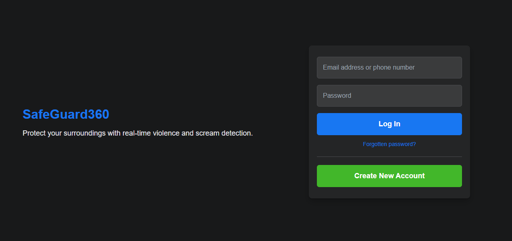
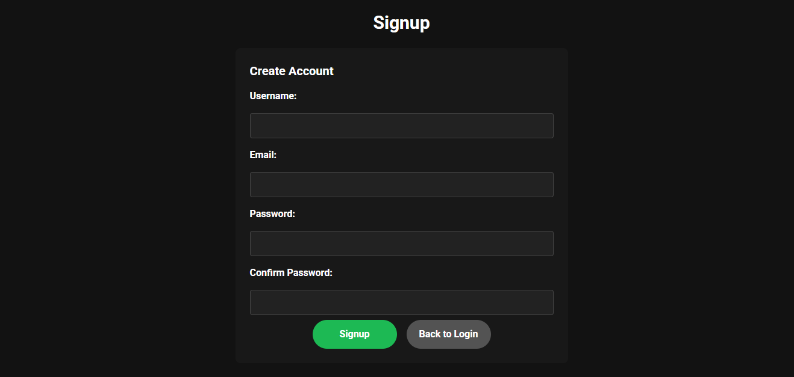
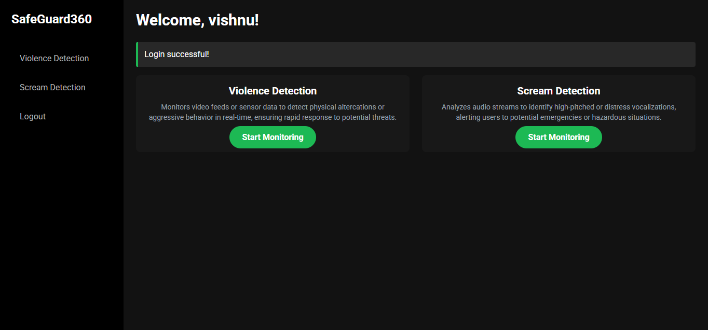
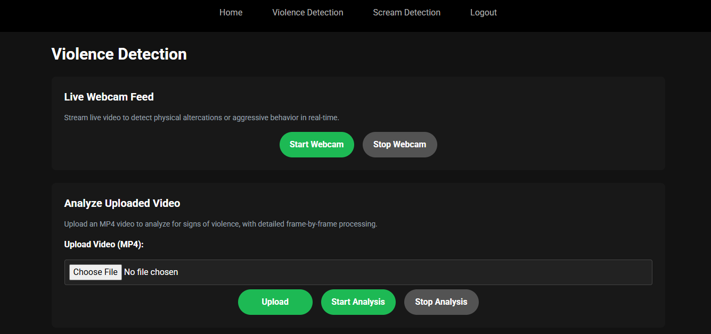
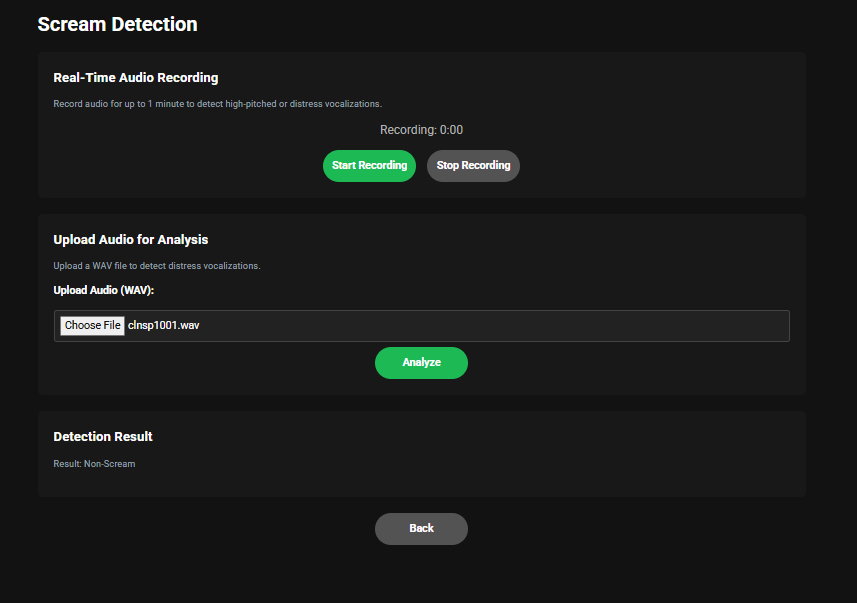
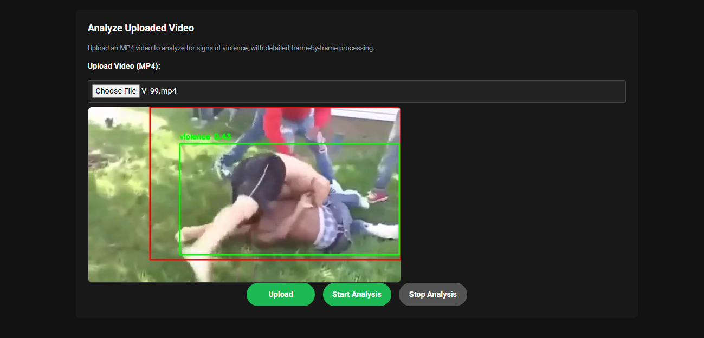

# 🔐 Violence & Scream Detection Surveillance System

A Flask-based web surveillance system for **real-time violence and scream detection** using:

- **YOLOv8** for object and violence detection from video
- **Custom Scream Detection** model using PyTorch
- **Live Webcam & Video File Processing**
- **Audio Validation for Screams**
- **Automatic Alerts** via **Email**, **WhatsApp**, and **SMS**

---

## 📸 Screenshots

### 1. 🏠 Login Page  


### 2. 🏠 Signup Page  


### 3. 🏠 Home Page  


### 4. 📹 Violence Detection Page  


### 5. 🎞️ Scream Detection Page  


### 6. 🎧 Scream Detection Result  


### 7. 🚨 Violence Detection Result  



---

## ⚙️ Features

✅ Real-time **Webcam & Video File Detection**  
✅ Integrated **YOLOv8** for Object/Violence Detection  
✅ Custom **Scream Classifier** with PyTorch  
✅ **Audio Validation** using librosa  
✅ Sends Alerts via:
- 📧 Email (SMTP)
- 📞 WhatsApp (Twilio)
- 📲 SMS (Twilio)

---

## 🧠 Tech Stack

| Technology | Purpose |
|------------|---------|
| **Flask**  | Web framework |
| **YOLOv8** | Object detection (Ultralytics) |
| **OpenCV** | Video stream handling |
| **PyTorch** | Scream classification model |
| **librosa** | Audio validation |
| **Twilio API** | SMS and WhatsApp alerting |
| **smtplib** | Email alerts |

---

## 🚀 How to Run

### 1. Clone the Repository

```bash
git clone https://github.com/yourusername/violence-scream-detection.git
cd violence-scream-detection


HOSTED WEBISTE ONLY FOR THE USER INTERFACE

